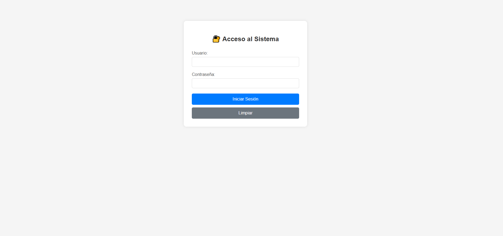
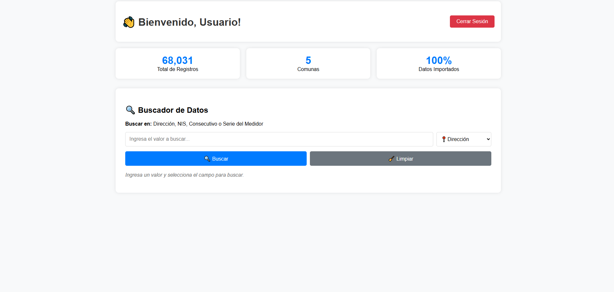
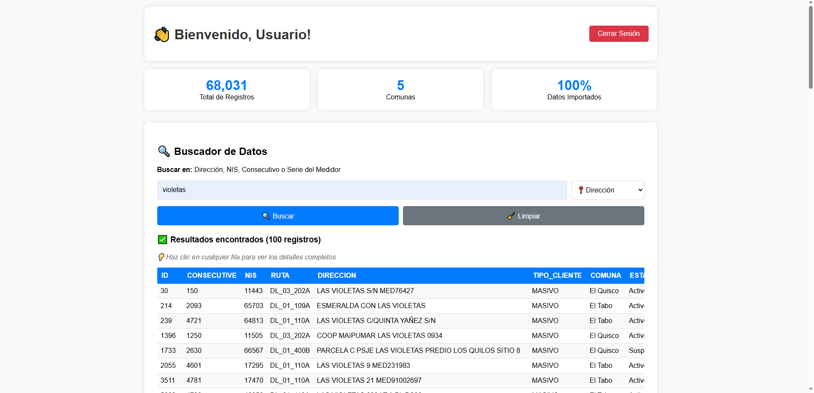
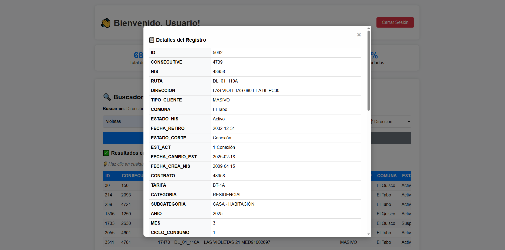

# 🔍 Proyecto Nikolito - Buscador de Datos

Aplicación web para búsqueda de datos en base de datos de servicios públicos.

## 🚀 Características

- ✅ Sistema de autenticación con límite de intentos
- ✅ Buscador en 4 campos específicos: Dirección, NIS, Consecutivo, Serie Medidor
- ✅ Visualización de todas las 52 columnas de datos
- ✅ Tabla transpuesta para resultados únicos
- ✅ Optimizado para dispositivos móviles
- ✅ Base de datos en Supabase (68,031 registros)

## 🛠️ Tecnologías

- **Backend**: Node.js + Express
- **Base de datos**: Supabase (PostgreSQL)
- **Frontend**: HTML + CSS + JavaScript vanilla
- **Autenticación**: Express Session
- **Hosting**: Railway

## 📸 Capturas de Pantalla







## 👥 Usuarios de Prueba

- **admin** / admin123
- **marcelo** / marcelo123
- **test** / test123

## 🔍 Campos de Búsqueda

- **Dirección**: Búsqueda en direcciones de servicios
- **NIS**: Número de Identificación del Suministro
- **Consecutivo**: Número consecutivo del registro
- **Serie Medidor**: Serie del medidor eléctrico

## 🚀 Instalación Local

```bash
# Clonar repositorio
git clone [URL_DEL_REPO]

# Instalar dependencias
npm install

# Ejecutar aplicación
npm start
```

## 🌐 Variables de Entorno

```
PORT=3000
SUPABASE_URL=tu_supabase_url
SUPABASE_ANON_KEY=tu_supabase_key
SESSION_SECRET=tu_secreto_de_sesion
NODE_ENV=production
```

## 📱 Uso

1. Acceder a la aplicación
2. Iniciar sesión con credenciales válidas
3. Seleccionar campo de búsqueda
4. Ingresar valor a buscar
5. Ver resultados en tabla (transpuesta si es 1 resultado)

## 🔒 Seguridad

- Límite de 5 intentos de login
- Bloqueo temporal de 1 minuto
- Sesiones seguras con HTTPS en producción
- Validación de campos de búsqueda

---

Desarrollado por Marcelo Olea para Proyecto Nikolito
